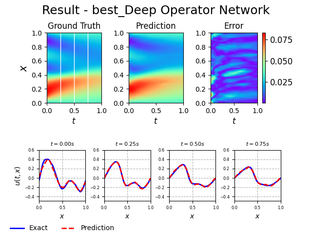
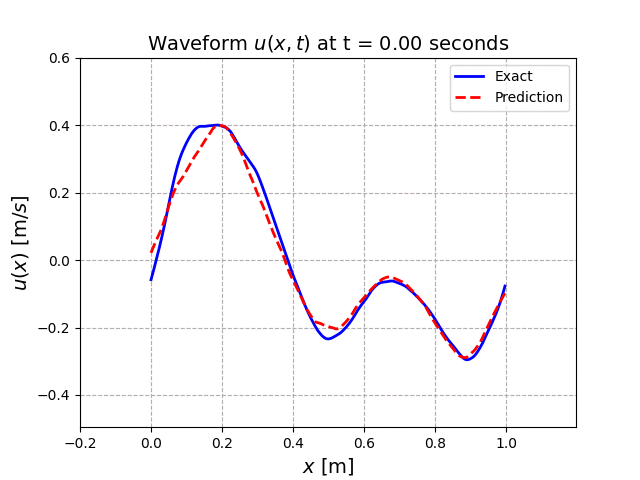
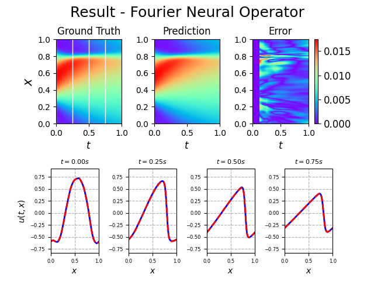
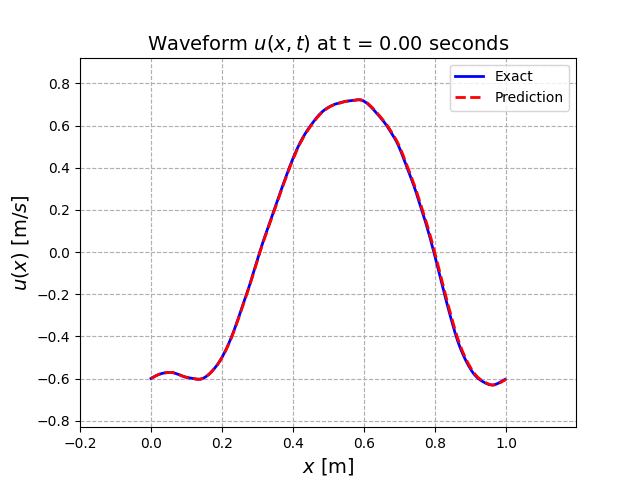

# PDE with Deep Learning

- [PDE with Deep Learning](#pde-with-deep-learning)
  - [Preview](#preview)
    - [DeepONet](#deeponet)
    - [Fourier Neural Operator](#fourier-neural-operator)
  - [Usage](#usage)
  - [Setup](#setup)
  - [References](#references)
    - [Physincs Informed Neural Network(PINN)s](#physincs-informed-neural-networkpinns)
    - [Neural Operators](#neural-operators)

## Preview

### DeepONet

| Full Field                            | Animation                            |
| ----------------------------------- | ----------------------------------- |
|  | 

### Fourier Neural Operator

| Full Field                            | Animation                            |
| ----------------------------------- | ----------------------------------- |
|  | 

## Usage

- Data Generation

```bash
python src/create.py num_data=1000
```

- Training

```bash
# Training DNN
python src/train.py experiment=dnn
# Training PINN
python src/train.py experiment=pinn
# Training DeepONet
python src/train.py experiment=deeponet
# Train multiple models
python src/train.py --multirun experiment=dnn,pinn,deeponet
```

- Inference

```bash
# inference using DeepONet
python src/eval.py model_name=DeepONet
```

- Coverage

```bash
# test all
pytest
# test specific file
pytest tests/test_collocations.py
```

## Setup

- pull docker image from docker hub

```bash
docker pull pytorch/pytorch:1.13.1-cuda11.6-cudnn8-runtime
```

- When the container starts:

```bash
# Update
apt-get update
apt-get upgrade -y
apt-get install wget curl git vim systemd imagemagick -y

# setup zsh
apt-get install zsh
curl -L https://raw.github.com/robbyrussell/oh-my-zsh/master/tools/install.sh | sh

# zsh - install plugins
git clone https://github.com/zsh-users/zsh-syntax-highlighting.git ${ZSH_CUSTOM:-~/.oh-my-zsh/custom}/plugins/zsh-syntax-highlighting
git clone https://github.com/zsh-users/zsh-autosuggestions ${ZSH_CUSTOM:-~/.oh-my-zsh/custom}/plugins/zsh-autosuggestions
# (1) change plugins=(git) -> plugins=(git zsh-syntax-highlighting zsh-autosuggestions)
# (2) add a line -> PROMPT='%{$fg[yellow]%}[%D{%y/%m/%f} %D{%L:%M:%S}] '$PROMPT
vim ~/.zshrc
# then reload or reopen window

# install requirements
pip install -r requirements.txt
```

## References

### Physincs Informed Neural Network(PINN)s

- [PINNs](https://faculty.sites.iastate.edu/hliu/files/inline-files/PINN_RPK_2019_1.pdf)

### Neural Operators

- [PCA-Net](https://arxiv.org/pdf/2005.03180.pdf)

- [Low-rank Neural Operator(LNO)](https://arxiv.org/pdf/2108.08481.pdf)

- [Graph Neural Operator(GNO)](https://arxiv.org/pdf/2003.03485.pdf)

- [Multipole Graph Neural Operator(MGNO)](https://arxiv.org/pdf/2006.09535.pdf)

- [Deep Operator Network(DeepONet)](https://arxiv.org/pdf/1910.03193.pdf)

- [PARA-Net](https://arxiv.org/pdf/2203.13181.pdf)

- [Fourier Neural Operator(FNO)](https://arxiv.org/pdf/2010.08895.pdf)

- [Geometry-aware Fourier Neural Operator(Geo-FNO)](https://arxiv.org/pdf/2207.05209.pdf)

- [Markov Neural Operator(MNO)](https://arxiv.org/pdf/2106.06898.pdf)

- [Multiwavelet Operator](https://arxiv.org/pdf/2109.13459.pdf)

- [Spectral Neural Operator(SNO)](https://arxiv.org/pdf/2205.10573.pdf)
